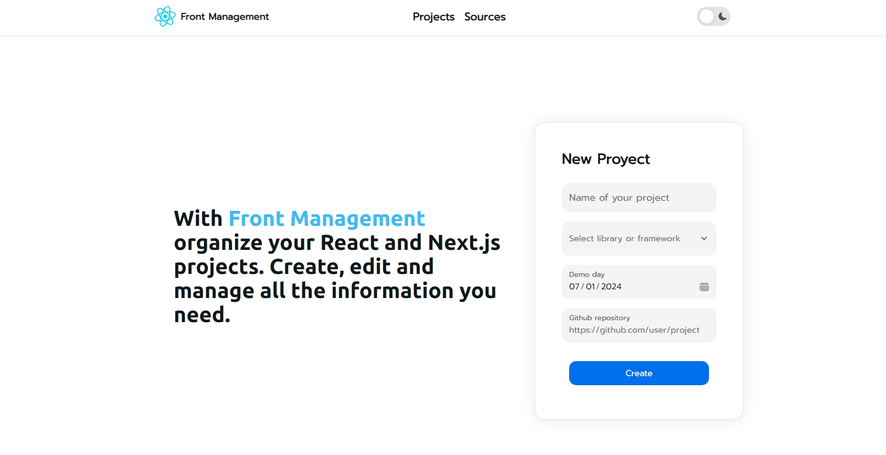

# Front Management



Front Management es una aplicación para organizar y gestionar proyectos de React y Next.js. Permite crear, editar y administrar toda la información necesaria para tus proyectos.

## URL del Deploy

[Front Management](https://front-management.vercel.app)

## Instrucciones para Ejecutar Localmente

Sigue estos pasos para ejecutar el proyecto en tu máquina local:

1. Clona el repositorio:

```bash
git clone https://github.com/Arielstereo/Front-Management.git
```

2. Navega al directorio del proyecto:
```bash
cd front-management
```

3. Instala las dependencias:
```bash
npm install
# o
yarn install
# o
pnpm install
```

4. Crea un archivo `.env.local` en la raíz del proyecto y agrega tus variables de entorno necesarias, por ejemplo:
```bash
MONGODB_URI=tu_mongodb_uri
```

5. Ejecuta el servidor de desarrollo:
```bash
npm run dev
# o
yarn dev
# o
pnpm dev
```

6. Abre [http://localhost:3000](http://localhost:3000) en tu navegador para ver la aplicación.